# Introduction To CICD

## Continuous Integration and Continuous Delivery (CI/CD) is a set of best practices and methodologies that revolutionize the software development lifecycle by enhancing efficiency, reliability, and speed. CI/CD represents a seamless integration of automation and collaboration throughout the development process, aiming to deliver high-quality software consistently and rapidly. 

## In the realm of CI, developers regularly integrate their code changes into a shared repository, triggering automated builds and tests to detect integration issues early. On the other hand, 

## CD encompasses both Continuous Delivery and Continuous Deployment, ensuring that software is always in a deployable state and automating the deployment process for swift and reliable releases. The CI/CD pipeline fosters a culture of continuous improvement, allowing development teams to iterate quickly, reduce manual interventions, and deliver software with confidence.

## What is Jenkins

### Jenkins is widely employed as a crucial CI/CD tool for automating software development processes. Teams utilize Jenkins to automate building, testing, and deploying applications, streamlining the development lifecycle. With Jenkins pipelines, developers can define, version, and execute entire workflows as code, ensuring consistent and reproducible builds. 

### Integration with version control systems allows Jenkins to trigger builds automatically upon code changes, facilitating early detection of issues and enabling teams to deliver high-quality software at a faster pace. Jenkins' flexibility, extensibility through plugins, and support for various tools make it a preferred choice for organizations aiming to implement efficient and automated DevOps practices.

## Project Goals

### 1. By the end of this project, learners should have;

### 2. Developed a foundational understanding of Continuous Integration (CI) and Continuous Delivery (CD) principles, and articulate their role in improving software development processes.

### 3. Acquired proficiency in using Jenkins by mastering installation, configuration, and navigation through the Jenkins user interface, and gain hands-on experience in creating and managing Jenkins jobs.

### 4. Learned the end-to-end process of automating software builds, running automated tests, and deploying applications using Jenkins, fostering a practical understanding of CI/CD pipelines. -Apply best practices in CI/CD processes, including parameterized builds, integration with external tools, and leveraging containerization technologies like Docker

## Project Highlight

- Introduction To CICD

- What is Jenkins

- Project Pre-requisites

- Project Goals

- Getting Started With Jenkins

- Jenkins Job

- Creating a Freestyle Project

- Connecting Jenkins To Our Source Code Management

- Configuring Build Trigger

- Creating a Pipeline Job

- Configuring Build Trigger

- Writing Jenkins Pipeline Script

- Installing Docker

- Building Pipeline Script

## Getting Started With Jenkins

### Jenkins Server Dashboard

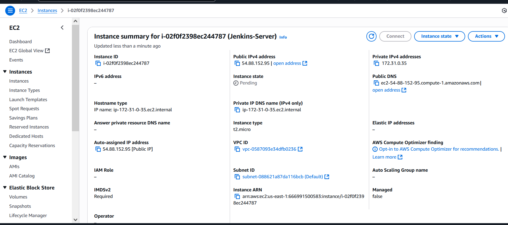

### Updating the Package

`sudo apt update`

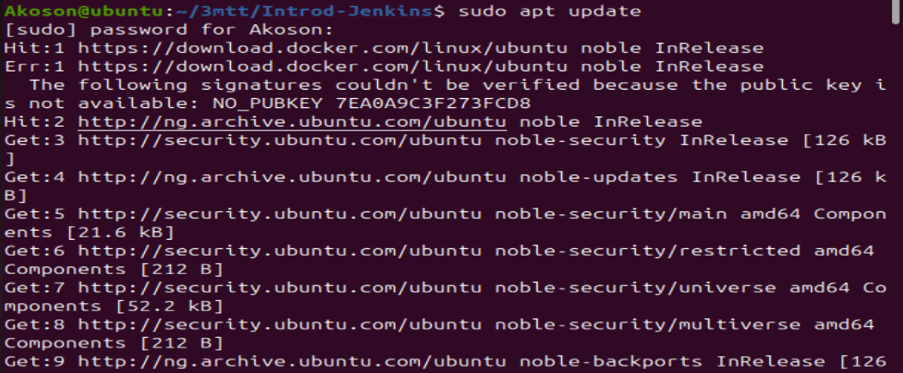

### Installing JDK

`sudo apt install default-jdk-headless`

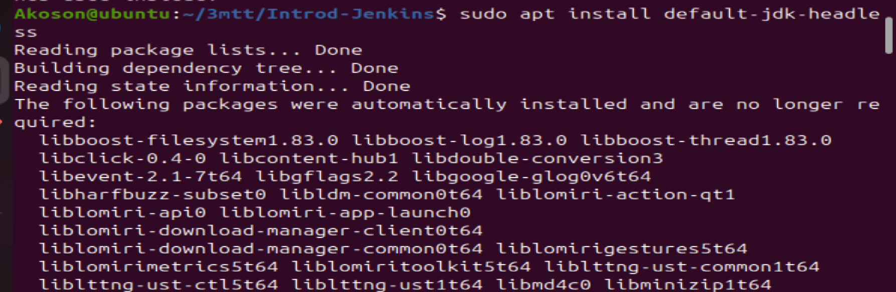

### Install Jenkins

    `wget -q -O - https://pkg.jenkins.io/debian-stable/jenkins.io.key | sudo apt-key add -
    sudo sh -c 'echo deb https://pkg.jenkins.io/debian-stable binary/ > \
    /etc/apt/sources.list.d/jenkins.list'
    sudo apt update
    sudo apt-get install jenkins`

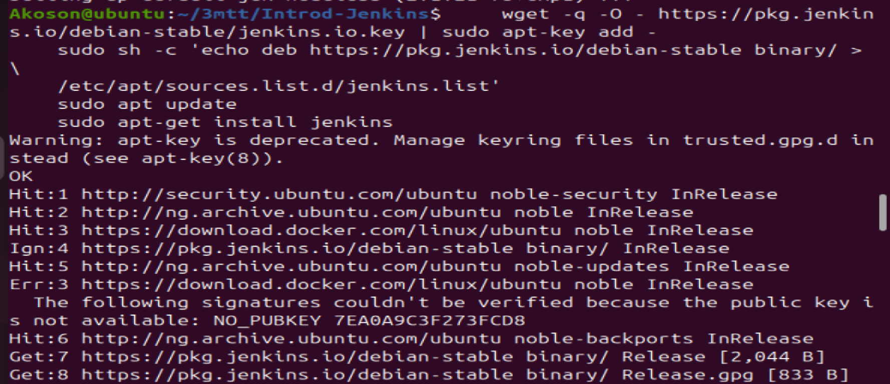

### The command installs Jenkins. It involves importing the Jenkins GPG key for package verification, adding the Jenkins repository to the system sources, updating package lists, and finally, installing Jenkins through the package manager (apt-get)

## Checking id Jenkins has been installed, and it is up and running

`sudo systemctl status jenkins`

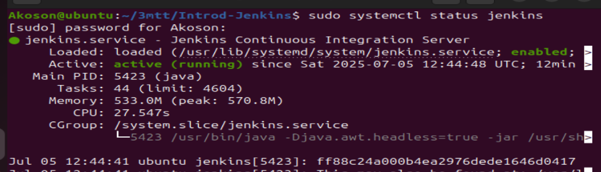

## On our Jenkins Server, we will create new inbound rules for port 8080 in Security Group.

### By default Jenkins listen on port 8080, we need to create an Inbound Rules for this in the security group of our Jenkins Server.

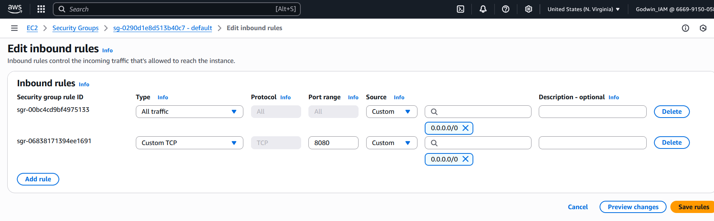

## Setting Up On The Console

### 1. Input your instance IP address on your web browser ie http://pblic-ip-address:8080

### 2. On your Jenkins Server, check `/var/lib/jenkins/secrets/initialAdminPassword` to know your password.

### Access Jenkins through the browser 

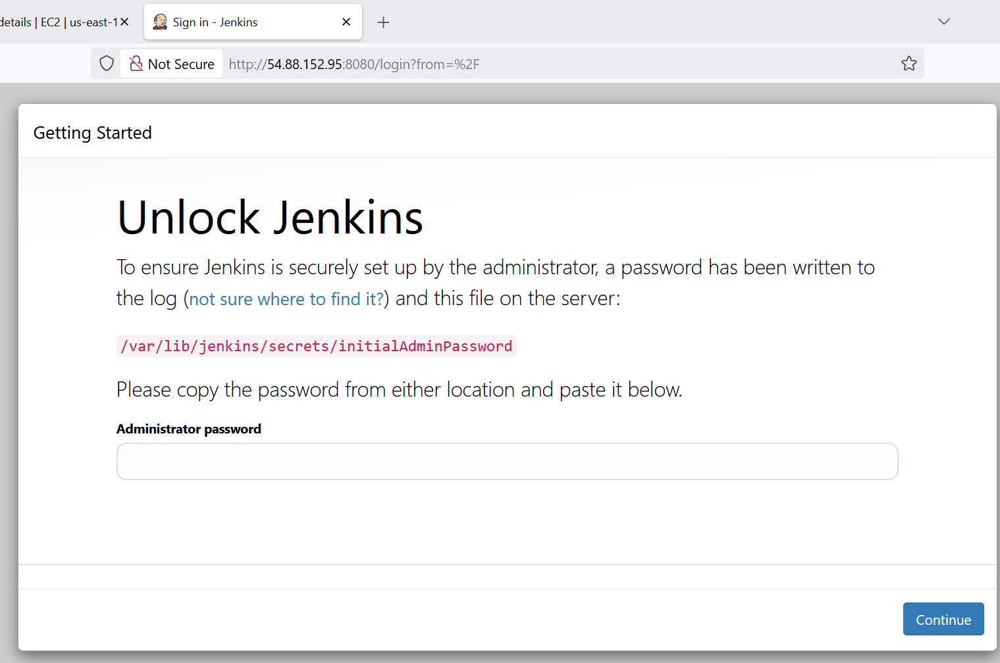

### Access Jenkins InitialAdminPassword by using the command on Jenkins server terminal

`sudo cat /var/lib/jenkins/secrets/initialAdminPassword`

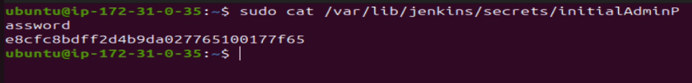

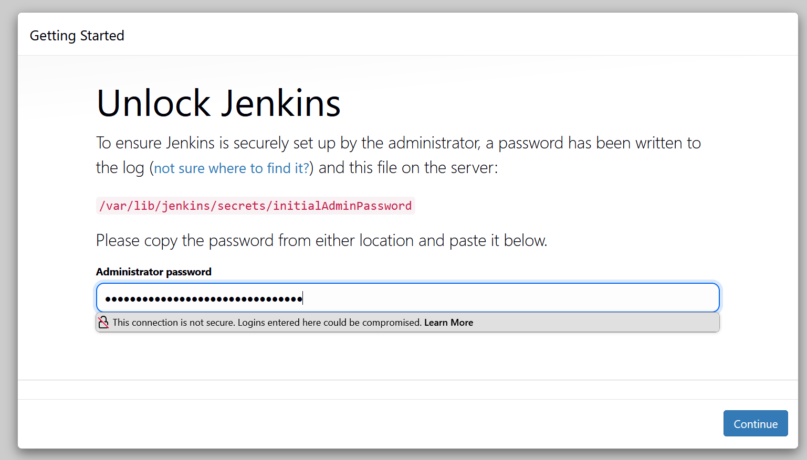

### Successfully Login to Jenkins

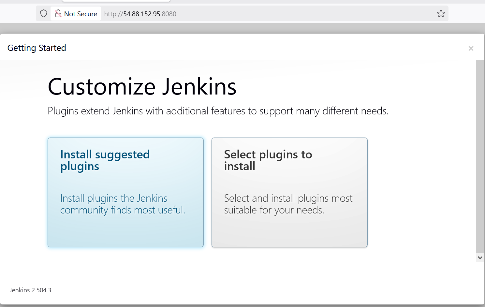

### Installing Suggested Plugins and creating Admin User

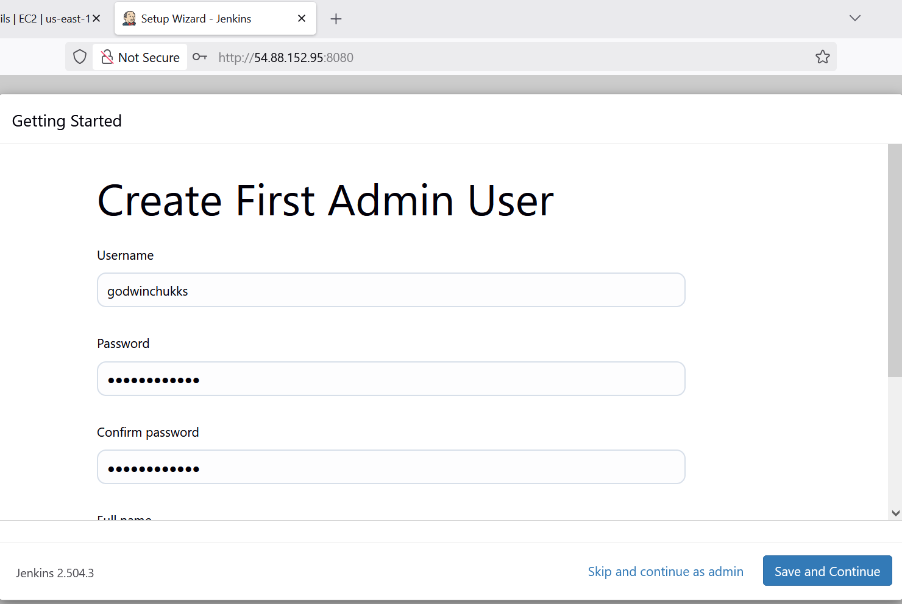

### Instance configuration

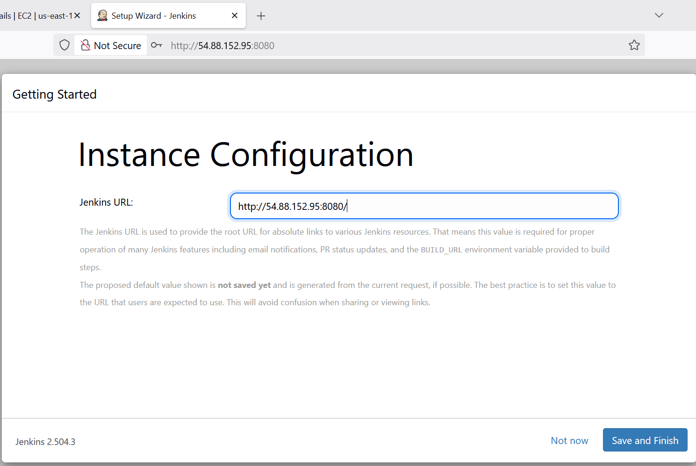

### Jenkins Setup successful

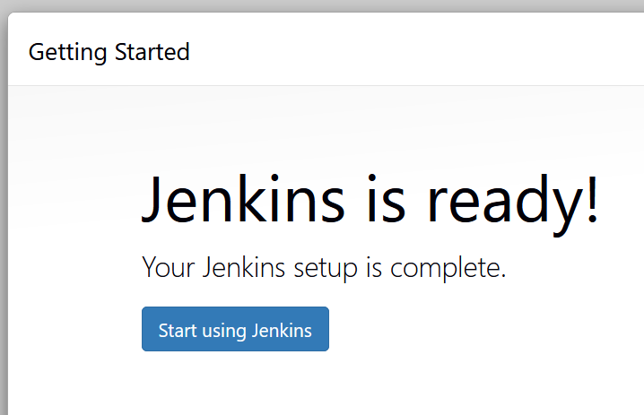

### Log in to Jenkins Console

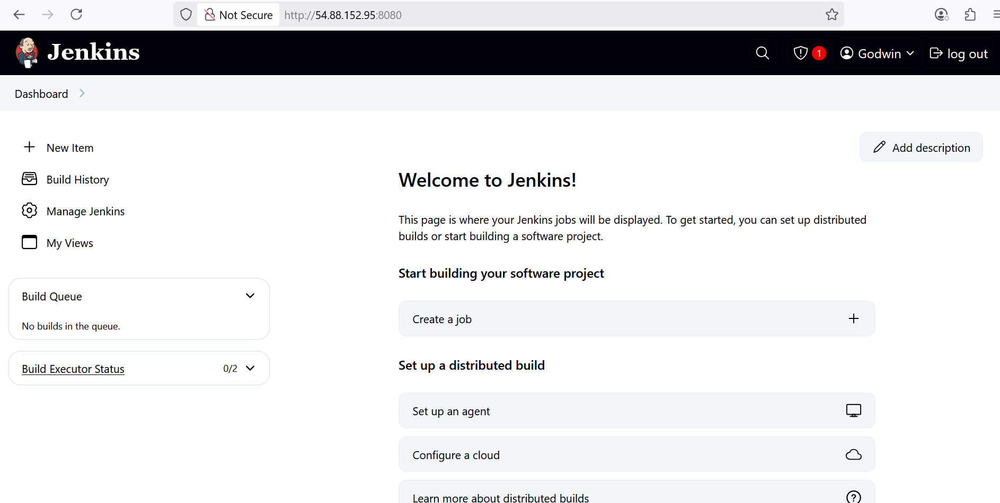

## Create a Simple Jenkins Job (Freestyle)

### This job lets Jenkins run basic commands like checking your code or printing messages.

## Steps:

### Go to Jenkins dashboard → click “New Item”

13

### I will name it Freestyle-Firstjob. Select Freestyle project and click OK

14

### Configuring free style job

15

- Under Build, I will add a "Shell Command" with this:

16

`echo "This is my first Jenkins build job!"`

- Then I will Click Build Now and the message will be printed in the console.

17

## Pipeline Job + Jenkinsfile (CI/CD Automation)

### Configuring job with pipeline

18

### Creating Jenkinsfile

19

### Jenkins Pipeline Configuration

20

21

22

